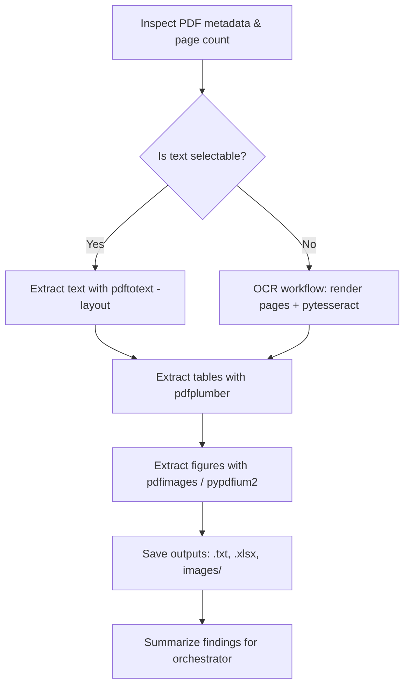

# Reading Research Papers with the PDF Skill

This document describes a step-by-step workflow for reading and extracting
content from research papers (PDFs) using the **PDF skill**
(`.agents/skills/pdf/SKILL.md`). It covers text extraction, figure extraction,
table extraction, and OCR for scanned documents.

The workflow is designed to be used by the **researcher** agent when analyzing
papers such as the octree-generation reference paper linked in `refs/`.

---

## 0. Prerequisites

The PDF skill relies on a mix of Python libraries and command-line tools.
Ensure the following are available in the environment:

| Tool | Purpose | Install |
|------|---------|---------|
| `pypdf` | Basic read / metadata / merge / split | `pip install pypdf` |
| `pdfplumber` | Text + table extraction with layout | `pip install pdfplumber` |
| `pypdfium2` | Fast page rendering to images | `pip install pypdfium2` |
| `Pillow` | Image handling | `pip install pillow` |
| `numpy` | Image processing for figure detection | `pip install numpy` |
| `pandas` | Table post-processing | `pip install pandas` |
| `pytesseract` | OCR engine wrapper | `pip install pytesseract` |
| `pdf2image` | PDF → image conversion for OCR | `pip install pdf2image` |
| `poppler-utils` | `pdftotext`, `pdfimages` (fast CLI) | `sudo apt install poppler-utils` |
| `tesseract-ocr` | OCR engine | `sudo apt install tesseract-ocr` |

> **Note for this project:** if a new Python package is required, add it to
> `env.yml` and run `mamba env update -f env.yml --prune` (see `AGENTS.md`).

---

## 1. Inspect the Document

Before extracting anything, get an overview of the paper.

from pypdf import PdfReader

reader = PdfReader("paper.pdf")
print(f"Pages: {len(reader.pages)}")
meta = reader.metadata
print(f"Title: {meta.title}")
print(f"Author: {meta.author}")
print(f"Subject: {meta.subject}")
```

**Decision point:** if the extracted text is empty or garbled, the PDF is
likely a **scanned image** and you must use the **OCR workflow** (Section 5).

---

## 2. Text Extraction

### 2.1 Fast CLI extraction (poppler)

```bash
# Preserve reading layout
pdftotext -f 1 -l 5 -layout paper.pdf paper_front.txt
```
### 2.2 Python extraction with layout (pdfplumber)

```python
import pdfplumber

with pdfplumber.open("paper.pdf") as pdf:
    for i, page in enumerate(pdf.pages):
        text = page.extract_text()
        print(f"--- Page {i+1} ---")
        print(text)
```

### 2.3 Text with coordinates (for structured reading)

```python
import pdfplumber

with pdfplumber.open("paper.pdf") as pdf:
    page = pdf.pages[0]
    # Extract text within a bounding box (left, top, right, bottom)
    bbox_text = page.within_bbox((100, 100, 400, 200)).extract_text()
    print(bbox_text)
```

**Best practice:** use `pdftotext -bbox-layout` for the fastest plain-text
extraction on large documents; avoid `pypdf.extract_text()` for very large
files.

---

## 3. Figure Extraction

### 3.1 Fastest: `pdfimages` (poppler)

```bash
# Extract all embedded images at original quality
pdfimages -all paper.pdf images/img

# List image info without extracting
pdfimages -list paper.pdf

# Extract with page number in the filename
pdfimages -j -p paper.pdf page_images
```

### 3.2 Render-based figure detection (pypdfium2 + numpy)

Use this when figures are vector graphics (not embedded raster images), which
`pdfimages` cannot capture.

```python
import pypdfium2 as pdfium
from PIL import Image
import numpy as np

def extract_figures(pdf_path, output_dir):
    pdf = pdfium.PdfDocument(pdf_path)
    for page_num, page in enumerate(pdf):
        bitmap = page.render(scale=3.0)   # high resolution
        img = bitmap.to_pil()
        img_array = np.array(img)
        # Simple figure detection: non-white regions
        mask = np.any(img_array != [255, 255, 255], axis=2)
        # Find contours / bounding boxes and crop figures...
        # (real implementation needs more sophisticated detection)
```

**Best practice:** `pdfimages` is much faster than rendering pages. Prefer it
for raster figures; fall back to rendering for vector figures.

---

## 4. Table Extraction

### 4.1 Basic table extraction (pdfplumber)

```python
import pdfplumber

with pdfplumber.open("paper.pdf") as pdf:
    for i, page in enumerate(pdf.pages):
        tables = page.extract_tables()
        for j, table in enumerate(tables):
            print(f"Table {j+1} on page {i+1}:")
            for row in table:
                print(row)
```

### 4.2 Advanced extraction with custom settings

```python
import pdfplumber

table_settings = {
    "vertical_strategy": "lines",
    "horizontal_strategy": "lines",
    # or "text" strategy for tables without ruling lines
}

with pdfplumber.open("paper.pdf") as pdf:
    for page in pdf.pages:
        tables = page.extract_tables(table_settings)
        # ...
```

### 4.3 Export to DataFrame / Excel

```python
import pdfplumber
import pandas as pd

with pdfplumber.open("paper.pdf") as pdf:
    all_tables = []
    for page in pdf.pages:
        for table in page.extract_tables():
            if table:
                df = pd.DataFrame(table[1:], columns=table[0])
                all_tables.append(df)

if all_tables:
    combined = pd.concat(all_tables, ignore_index=True)
    combined.to_excel("extracted_tables.xlsx", index=False)
```

### 4.4 Visual debugging

```python
import pdfplumber

with pdfplumber.open("paper.pdf") as pdf:
    page = pdf.pages[0]
    img = page.to_image(resolution=150)
    img.save("page_debug.png")
```

---

## 5. OCR Workflow (Scanned PDFs)

Use this when the PDF is a scanned image (no selectable text) or when text
extraction returns empty/garbled output.

### 5.1 Full-document OCR

```python
import pytesseract
from pdf2image import convert_from_path

def extract_text_with_ocr(pdf_path):
    images = convert_from_path(pdf_path)
    text = ""
    for i, image in enumerate(images):
        text += f"Page {i+1}:\n"
        text += pytesseract.image_to_string(image)
        text += "\n\n"
    return text
```

### 5.2 Render pages to images first (pypdfium2)

```python
import pypdfium2 as pdfium

pdf = pdfium.PdfDocument("scanned.pdf")
for i, page in enumerate(pdf):
    bitmap = page.render(scale=2.0)
    img = bitmap.to_pil()
    img.save(f"page_{i+1}.png", "PNG")
```

Then run `pytesseract.image_to_string()` on each rendered page.

### 5.3 OCR a single figure / region

```python
import pytesseract
from PIL import Image

img = Image.open("figure.png")
text = pytesseract.image_to_string(img)
print(text)
```

---

## 6. Recommended End-to-End Workflow

For a typical research paper, follow this order:



### Checklist

1. **Inspect** the PDF (metadata, page count).
2. **Extract text** — `pdftotext -layout` (fast) or `pdfplumber`.
3. **Extract tables** — `pdfplumber.extract_tables()`, export to Excel.
4. **Extract figures** — `pdfimages -all` (raster) or render-based detection.
5. **OCR** — only if the PDF is scanned or text is garbled.
6. **Save outputs** into a dedicated folder (e.g. `refs/extracted/`).
7. **Report** a structured summary back to the orchestrator.

---

## 7. Troubleshooting

| Problem | Solution |
|---------|----------|
| Empty / garbled text | PDF is scanned → use OCR workflow (Section 5) |
| Tables not detected | Adjust `table_settings` (lines vs. text strategy) |
| Figures missing with `pdfimages` | Figures are vector → render pages (Section 3.2) |
| OCR poor quality | Increase render `scale` (e.g. 2.0–3.0) before OCR |
| Corrupted PDF | `qpdf --check corrupted.pdf` to diagnose |

---

## 8. References

- PDF skill main guide: `.agents/skills/pdf/SKILL.md`
- PDF skill advanced reference: `.agents/skills/pdf/reference.md`
- PDF skill forms guide: `.agents/skills/pdf/forms.md`
